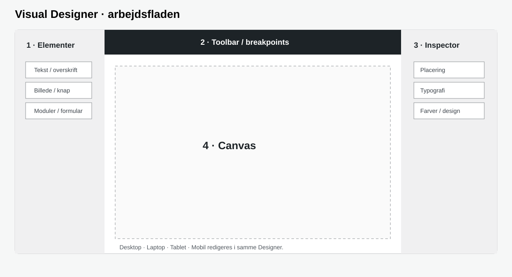
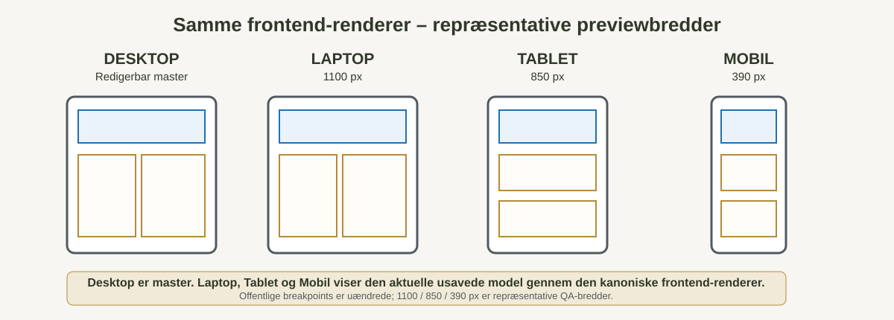

# Visual Designer Manager – Brugermanual

**Senest opdateret:** 12. september 2026  
**Gælder for:** Visual Designer Manager 3.0.0-alpha.35 og nyere  
**Manualversion:** 1.3  
**Målgruppe:** Redaktører og administratorer i WordPress

> Denne online-manual beskriver den aktuelle brugeradfærd i Visual Designer Manager. Den illustrerede Word-udgave følger samme funktionskontrakt og indeholder flere grafiske eksempler.

## Brugermanualen på websitet og i Word

Brugermanualen findes som side på **`/visual-designer-brugermanual/`** og kan åbnes fra **Visual Designer Manager → Brugermanual**. Her kan Word-versionen også downloades. Når en brugerfunktion ændres, skal online- og Word-manualen opdateres sammen.

## 1. Introduktion og aktuel status

Visual Designer Manager er en modeldrevet visuel sidebygger til WordPress. Sider bygges som LEGO-klodser: **Sektioner** opdeler siden, **Kasser** organiserer lokale layouts, og indholdselementer som **Tekst**, **Billede** og **Knap** placeres i strukturen.

Den offentlige side ændres først ved en rigtig gemning. Preview, Undo/Redo og versionshistorik arbejder på den samme canonical model.

### Hovedpunkter i 3.0.0-alpha.35

- Desktop er den redigerbare master.
- Laptop, Tablet og Mobil bruger den **samme usavede frontend-renderer** som den offentlige side.
- Repræsentative Designer-previewbredder er **Laptop 1100 px**, **Tablet 850 px** og **Mobil 390 px**.
- De offentlige breakpoints er uændrede: Laptop max 1180 px, Tablet max 980 px og Mobil max 782 px.
- Mobil 390 px er fastholdt som regression-reference.
- Moduldesign har **Afstand til Footer (px)** fra 0–200 px, standard 64 px, for Events, Billedgalleri og Køretøjer.
- GitHub-updateren bruger den stabile V3-kanal og verificerer installationspakken med SHA-256.

## 2. Sådan er en webside bygget op

Header og Footer er globale. Selve siden består af Sektioner, Kasser og indholdselementer. Hero/Topbanner er sideindhold og ligger normalt øverst på selve siden.

| Del | Global | Del af den enkelte side |
|---|---:|---:|
| Tema / Shell | Ja, teknisk ramme | Nej |
| Header | Ja | Nej |
| Menu i Header/Footer | Global placering | Nej |
| Hero / Topbanner | Nej | Ja |
| Sektion | Nej | Ja |
| Kasse | Nej | Ja |
| Tekst / Billede / Knap | Normalt nej | Ja |
| Footer | Ja | Nej |

**Huskeregel:** Header og Footer er globale. Sektion = stort område. Kasse = lokal LEGO-klods.

## 3. Designerens opbygning

Åbn **Visual Designer Manager → Designer**, vælg en WordPress-side og klik **Åbn designer**.

| Område | Bruges til |
|---|---|
| Elementer til venstre | Tilføj elementer fra paletten |
| Canvas i midten | Byg, flyt og resize siden visuelt |
| Inspector til højre | Redigér egenskaber for det valgte element |

Klik på et element i responsive frontend-preview for at vælge det tilsvarende element i Inspector.

## 4. Sektion, Kasse og LEGO-hierarki

En **Sektion** er et hovedområde direkte på siden. En **Kasse** kan ligge i en Sektion eller en anden Kasse og bruges til lokal opdeling, kolonner og grupper.

- Sektioner kan indeholde Kasser og indhold.
- Kasser kan indeholde andre Kasser og indhold.
- Sektioner bruges ikke som almindelige nested Kasser.
- Baggrund, ramme, padding og auto-grow kan styres på strukturelementerne.

## 5. Tilføj, flyt og drop elementer

Klik på et element i paletten for at tilføje det, eller træk det direkte til den ønskede placering. Drag-and-drop anbefales, når et element skal ind i en bestemt Kasse eller en eksisterende celle skal deles.

Typiske drop-zoner:

- **OVER / UNDER** – deler den valgte celle lodret.
- **VENSTRE / HØJRE** – deler den valgte celle vandret.
- **INDE I** – flytter elementet ind i Kassen/Sektionen.
- **ROOT** – placerer elementet på sideniveau, når elementtypen tillader det.

## 6. Markeringer, resize og auto-grow

Det valgte element markeres i Canvas. Resize ændrer elementets geometri på Desktop-masteren. Parent-elementer kan vokse automatisk, når indhold kræver mere plads.

Hvis noget overlapper eller klippes:

1. Kontrollér at elementet ligger i den rigtige Sektion/Kasse.
2. Kontrollér Afstand X/Y, padding og minimumshøjde.
3. Kontrollér om elementet er Normal eller Flydende.
4. Sammenlign med **Forhåndsvis uden at gemme**.

## 7. Tekst og rich text

Tekst-elementet bruges til overskrifter, brødtekst, lister og links. Inspector styrer bl.a. typografi, farve, alignment, baggrund, padding, ramme og radius.

Rich-text-funktioner som Fed, Kursiv og Understregning skal bevare tekstmarkeringen og må ikke ændre elementtypen.

## 8. Billede og links

Billede består af billedboksen og selve billedindholdet. Tilpasning kan være fx **Contain**, **Cover**, **Original**, **Stretch** eller manuel placering afhængigt af den aktuelle elementkontrakt.

Ved fejlfinding skal du skelne mellem størrelsen på billedboksen og billedets egen tilpasning inde i boksen.

## 9. Knap og Flydende Knap

Knap er en selvstændig elementtype og må ikke behandles som Tekst.

- **Normal Knap** deltager i det almindelige layout.
- **Flydende Knap** er et parent-relativt overlay, reserverer ikke en normal grid-celle og skubber ikke søskende.
- Feltet **Lag** styrer rækkefølgen mellem flere flydende elementer.

## 10. Styling, rammer, afstand og Inspector

Inspector er den autoritative brugerflade for det valgte elements egenskaber. Almindelige stylingområder er:

- baggrund og tekstfarve
- typografi og alignment
- padding og afstand
- ramme, tykkelse og radius
- billedtilpasning
- link og knapadfærd
- responsive sideafstande

## 11. Tabel og kommende elementer

Tabel er planlagt som native Visual Designer-element med rækker, kolonner, overskriftsrække, cellemarkering og Excel-lignende rammevalg.

Andre planlagte/native udvidelser kan omfatte Divider, Spacer, Icon, Galleri, Video, Accordion/FAQ, Tabs og Formular.

## 12. Responsive Desktop / Laptop / Tablet / Mobil

Alpha.35 bruger samme frontend-renderer til responsive preview som den offentlige side. Designerens responsive visninger er derfor parity-visninger og ikke en separat layoutmotor.

| Visning | Princip / renderbredde |
|---|---|
| Desktop | Redigerbar masterlayout i Designer |
| Laptop | Kanonisk frontend-preview ved **1100 px** |
| Tablet | Kanonisk frontend-preview ved **850 px** |
| Mobil | Kanonisk frontend-preview ved **390 px** |
| Klik i preview | Vælger tilsvarende element i Inspector |

Previewen kan skaleres visuelt for at være i Designer-kolonnen, men selve iframe-renderingen sker ved ovenstående CSS-pixelbredder.

### Hvorfor 1100 / 850 / 390?

Alpha.34 brugte Laptop 1180 px og Tablet 980 px, dvs. præcis på breakpoint-grænserne. Alpha.35 tester i stedet inde i de respektive intervaller, så preview repræsenterer en normal Laptop/Tablet og ikke en kanttilstand. De offentlige breakpoint-grænser ændres ikke.

## 13. Preview, Gem og versionsstyring

**Forhåndsvis uden at gemme** viser den aktuelle usavede model i den rigtige frontend med Theme Shell, Header og Footer uden at ændre den offentlige side. På Laptop, Tablet og Mobil er denne frontend-preview selve parity-visningen.

**Gem som ny version**:

1. normaliserer layoutmodellen
2. opretter en ny versionspost
3. læser modellen tilbage
4. verificerer den gemte model
5. bevarer tidligere versioner

Historiske versioner kan forhåndsvises. Gendannelse skal være ikke-destruktiv og gemme den historiske model som en ny version.

## 14. Header, Footer, Menu og Theme Shell

Header og Footer har globale canonical modeller og versionshistorik. Frontend og responsive Designer-preview genbruger samme Renderer/ResponsiveRenderer.

Footerens **Genveje** følger den valgte WordPress Website-menu dynamisk. Visual Designer styrer præsentation, spacing og responsive adfærd, mens menuens indhold vedligeholdes centralt i WordPress.

### Modulafstand til Footer

På **Events**, **Billedgalleri** og **Køretøjer** findes under Moduldesign feltet **Afstand til Footer (px)**:

- interval: **0–200 px**
- standard: **64 px**
- gælder både moduloversigt og dynamisk detaljeside

Det bruges eksempelvis til at sikre luft mellem sidste Event-knap/indhold og den globale Footer.

## 15. Opdatering, backup, diagnose og fejlfinding

### Opdatering

1. Gå til **Visual Designer Manager → Opdateringer**.
2. Klik **Tjek GitHub-opdatering**.
3. Installer den nyeste stabile V3-version, hvis en nyere version findes.
4. Updateren verificerer SHA-256 og opretter checkpoints før installation.

Du behøver normalt ikke installere hver Alpha i rækkefølge; den nyeste pakke indeholder tidligere rettelser.

### Ved fejl

Notér:

- hvad du gjorde
- hvad du forventede
- hvad der skete
- screenshot
- diagnose-link, hvis et sådant er tilgængeligt

## 16. Anbefalet arbejdsgang og QA

1. Åbn siden i Designer.
2. Tilføj/flyt Sektion, Kasse og elementer.
3. Redigér indhold og styling i Inspector.
4. Kontrollér overlap og hierarki.
5. Kontrollér **Desktop, Laptop, Tablet og Mobil**.
6. Brug **Forhåndsvis uden at gemme**.
7. Ret eventuelle fejl.
8. Klik **Gem som ny version**.
9. Brug **Gem & vis** og kontrollér den offentlige frontend.

### Hurtig QA før release

| Test | Forventning |
|---|---|
| Save / Reload | Canonical layout er identisk |
| Responsive | Desktop master; Laptop 1100 / Tablet 850 / Mobil 390 viser kanonisk frontend-preview |
| Preview / frontend | Samme renderer anvendes |
| Footer | Ingen kollision med sidste side-/modulindhold |
| Menu | Footer-Genveje følger valgt Website-menu |
| Updater | Seneste stabile manifest/version findes og SHA-256 verificeres |

## 17. Versionshistorik

| Manualversion | Ændring |
|---|---|
| 1.0 | Første brugermanual baseret på de tidlige Visual Designer-funktioner. |
| 1.1 | Illustreret Word-udgave med tabeller, diagrammer og grafiske eksempler. |
| 1.2 | Opdateret med websides anatomi, Knap/Floating, responsive visninger, Theme Shell og Header/Footer. |
| **1.3** | Opdateret til **3.0.0-alpha.35** med kanonisk responsive frontend-preview, bredder 1100/850/390 px, modulernes Footer-gap og stabil GitHub updater-kanal. |

### Relaterede dokumenter

- `CLEAN-DESIGN-MANUAL.md` – design- og arkitekturmanual.
- Teknisk manual / beslutningsregister – konkrete tekniske og UX-kontrakter.
- Release-manifestet `v3-update.json` – sandheden om den aktuelle stabile V3-version og installationspakken.

> **Vedligeholdelse:** Når en brugerfunktion ændres eller frigives, skal denne Markdown-manual og Word-manualen opdateres sammen. Grafiske illustrationer opdateres, når UI eller canonical model ændres.
