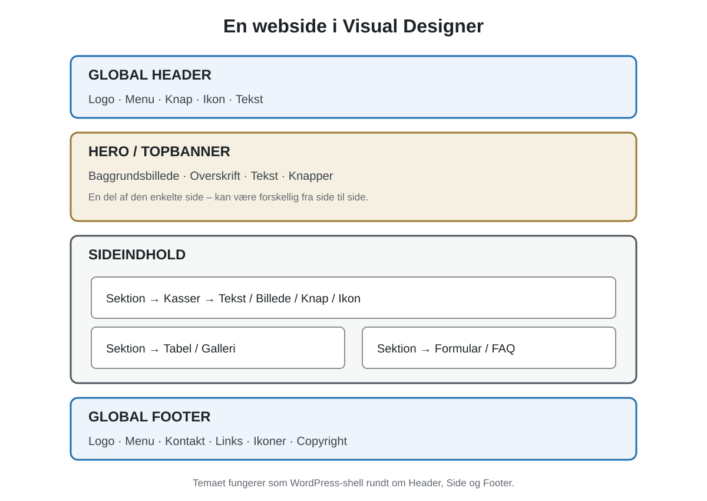
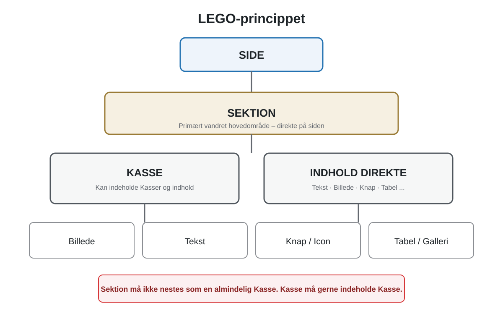
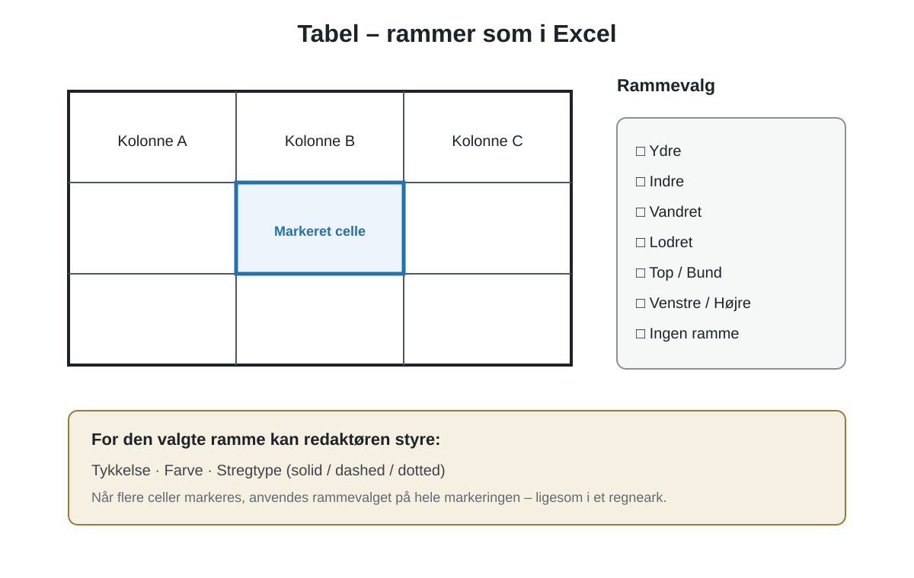

# Visual Designer Manager – Brugermanual

Senest opdateret: 28. august 2026  
Gælder for: Visual Designer Manager 0.1.39 og nyere; planlagte funktioner er mærket **Planlagt**  
Målgruppe: Redaktører og administratorer, der bygger og vedligeholder sider i WordPress

> Denne manual beskriver **hvordan Visual Designer Manager bruges i praksis**. Den tekniske arkitektur er beskrevet separat i `CLEAN-DESIGN-MANUAL.md`.

---

## 1. Hvad er Visual Designer Manager?

Visual Designer Manager er en visuel sidebygger til WordPress. Ideen er, at en side bygges som LEGO-klodser:

- **Sektioner** opdeler siden i større områder.
- **Kasser** bruges til lokale grupper og kolonner.
- **Tekst** bruges til overskrift og brødtekst.
- **Billede** bruges til billeder med en selvstændig billedboks.

Elementer kan flyttes med drag-and-drop, placeres over/under/venstre/højre for hinanden og lægges ind i Kasser og Sektioner.

Visual Designer gemmer siden i sin egen model og ændrer først den offentlige Visual Designer-side, når du vælger **Gem som ny version**.

### 1.1 Opret en ny side direkte i Manageren

Åbn **Visual Designer Manager → Sider**. Under **Ny side** kan du angive titel, valgfri slug, overordnet side og om siden skal starte som Kladde eller Publiceret. Vælg **Opret og åbn Designer**; WordPress-siden oprettes, og Visual Designer åbner den med et tomt layout. Første **Gem som ny version** opretter Visual Designer-version v1.

Du kan gentage dette for alle de sider, du skal bygge. Eksisterende WordPress-sider bliver fortsat vist i samme Sider-oversigt og kan åbnes i Designer.

---

## 2. Sådan er en webside bygget op

Visual Designer bygger en webside som LEGO. Nogle elementer skaber **struktur**, mens andre er **indhold**. Header og Footer er globale, mens den enkelte sides indhold bygges af Sektioner, Kasser og indholdselementer.



*Figur 1 – En typisk Visual Designer-side. Header og Footer er globale. Hero/Topbanner og resten af indholdet tilhører selve siden.*

### 2.1 Det overordnede princip

```text
WORDPRESS
└── TEMA / SHELL
    ├── GLOBAL HEADER
    │   ├── Logo
    │   ├── Menu
    │   ├── Knap
    │   └── Icon/Tekst
    │
    ├── SIDE
    │   ├── Hero / Topbanner
    │   ├── Sektion
    │   │   ├── Kasse
    │   │   │   ├── Billede
    │   │   │   └── Tekst
    │   │   └── Kasse
    │   │       ├── Tekst
    │   │       └── Knap
    │   ├── Divider
    │   ├── Sektion → Tabel
    │   ├── Sektion → Galleri
    │   └── Sektion → Formular / FAQ
    │
    └── GLOBAL FOOTER
        ├── Logo
        ├── Menu / Links
        ├── Kontakt
        ├── Icons
        └── Copyright
```

### 2.2 Tema / Shell

Temaet er den tekniske WordPress-ramme omkring Visual Designer. Det skal primært håndtere WordPress-lifecycle, hooks, `wp_head()`, `wp_footer()`, nødvendige wrappers, integration og fallback. Det visuelle design skal ligge i Visual Designer frem for i parallelle theme-regler.

**Status:** Theme Shell-konverteringen er under udvikling. Hangar18 Base Theme bruges fortsat som fallback/baseline, indtil visuel parity er godkendt.

### 2.3 Header

Header er et **globalt design** over den enkelte side. Den kan indeholde Logo, Menu, Tekst, Knap og Icon og har sin egen globale model og versionshistorik.

```text
┌──────────────────────────────────────────────────────┐
│ [LOGO]   Hjem  Køretøjer  Events  Galleri  [Kontakt]│
└──────────────────────────────────────────────────────┘
```

### 2.4 Menu

Menu er fra 0.1.39 et selvstændigt visuelt element i Header/Footer Designer. Vælg **+ Menu**, placer elementet i en Sektion/Kasse og vælg derefter en eksisterende WordPress-menu i Inspector. Menupunkterne vedligeholdes fortsat centralt i WordPress; Visual Designer gemmer kun menuens ID og præsentationen.

I Inspector kan du styre vandret/lodret retning, venstre/center/højre alignment, tekst-, hover- og aktiv-farve, baggrund, typografi, afstand mellem punkter, padding og mobilvisning. Mobilvisning kan være **Hamburger**, **Lodret menu** eller **Ombryd menupunkter**.

Header/Footer-preview kan bruges uden at Theme Shell overtager den offentlige side. Live cutover sker først, når Headeren er godkendt 1:1 på Desktop, Laptop og Mobil.

### 2.5 Hero / Topbanner

Hero/Topbanner er normalt den første store **Sektion inde i selve siden** og er derfor ikke det samme som Headeren. Hero er typisk stor og markant; Topbanner er samme idé i en lavere variant.

```text
GLOBAL HEADER
────────────────────────
HERO / TOPBANNER
  Baggrundsbillede
  Overskrift
  Undertekst
  [ Knap ]
────────────────────────
RESTEN AF SIDEN
────────────────────────
GLOBAL FOOTER
```

Hero/Topbanner bør være en Sektion-preset/specialisering med fx baggrundsbillede, focal point, overlay, højde og responsive overrides – ikke en separat layoutmotor.

**Status: Planlagt.**

### 2.6 Sektion, Kasse og LEGO-hierarkiet



*Figur 2 – Sektion er sidens hovedblok. Kasse er den fleksible lokale container. Kasser kan indeholde Kasser, men Sektioner nestes ikke som almindelige Kasser.*

```text
SIDE
└── SEKTION
    ├── KASSE
    │   ├── Billede
    │   └── Tekst
    └── KASSE
        ├── Tekst
        └── Knap
```

**Huskeregel:** Sektion = stort område. Kasse = lokal LEGO-klods.

### 2.7 Tekst

Tekst bruges til overskrift, brødtekst, lister og links. Et Tekst-element kan have H2-H6 og brødtekst i samme fysiske boks og kan styles med typografi, farver, alignment, baggrund, padding, ramme, radius og Afstand X/Y.

### 2.8 Billede

Billede består af **billedboksen** og **selve billedet**. Billedet kan fx vises som Contain, Cover, Original, Stretch eller Manuel inde i boksen.

Billede skal også kunne fungere som link med samme fælles linkmodel som Knap og Icon: Ingen, Intern side, Ekstern URL, Anker, E-mail eller Telefon samt *Åbn i ny fane* hvor relevant.

**Status for billede som link: Planlagt udvidelse.**

### 2.9 Knap

Knap er et selvstændigt element og skal ikke behandles som Tekst. Når **Knap trækkes fra paletten**, starter den som **Flydende Knap**, så den kan placeres frit på Side-root, i en Sektion eller Kasse uden at dele den celle, den ligger oven på. Derfor bruges der ikke Over/Under/Venstre/Højre cell-split under selve indsættelsen.

I Inspector kan Knap efterfølgende skiftes til **Normal**, hvis den i stedet skal deltage i det almindelige LEGO/grid-layout. En Flydende Knap er et parent-relativt overlay, reserverer ingen normal grid-celle og skubber ikke naboelementer. I editoren ligger Flydende Knap altid visuelt over normale elementer, også når et andet element markeres; feltet **Lag** bruges fortsat til rækkefølgen mellem flere flydende elementer og på frontend.

### 2.10 Icon

Icon bruges fx til telefon, mail, lokation, sociale medier, pil, download eller information og skal kunne styles og eventuelt fungere som link.

**Status: Planlagt.**

### 2.11 Divider

Divider er en visuel skillelinje med fx bredde, tykkelse, farve, alignment, afstand og solid/dashed/dotted streg.

**Status: Planlagt.**

### 2.12 Spacer

Spacer er en bevidst tom layoutblok. Den bruges kun, når fysisk tom plads skal være et selvstændigt element; normal afstand styres ellers med Afstand X/Y.

**Status: Planlagt.**

### 2.13 Tabel

Tabel bruges til strukturerede data med rækker, kolonner, overskriftsrække, kolonnebredder, tekst, links, farver, padding og alignment.



*Figur 3 – Planlagt Tabel-element. En eller flere celler kan markeres, hvorefter rammer vælges på samme måde som i et regneark.*

Rammer skal kunne vælges som **Ydre, Indre, Vandret, Lodret, Top, Bund, Venstre, Højre, Alle eller Ingen**. For valgte rammer skal tykkelse, farve og senere stregtype kunne styres. Flere celler skal kunne markeres samtidig. På mobil skal relevante strategier som vandret scroll, skjulte kolonner eller stablet label/værdi-visning kunne vælges.

**Status: Planlagt.**

### 2.14 Galleri

Galleri kan senere tilbyde Grid, Masonry, Slider/Carousel og Lightbox og kan efter fælles dataarkitektur kobles til Managerens galleri-data.

**Status: Native Visual Designer-element er planlagt.**

### 2.15 Video

Video kan bruges til fx YouTube, Vimeo eller lokal video med URL, controls, autoplay/mute, poster og aspect ratio.

**Status: Planlagt.**

### 2.16 Accordion / FAQ

Accordion/FAQ bruges til indhold, der åbnes og lukkes efter behov, fx ofte stillede spørgsmål.

**Status: Planlagt.**

### 2.17 Tabs

Tabs opdeler beslægtet indhold i faner, fx *Tekniske data*, *Historie* og *Billeder*.

**Status: Planlagt.**

### 2.18 Formular

Formular bruges til fx Kontakt, Bliv medlem og eventtilmelding og kan bestå af tekst-, e-mail-, telefon-, textarea-, valg- og submit-felter.

**Status: Planlagt.**

### 2.19 Dynamiske elementer

Dynamiske elementer kombinerer Manager-data med Visual Designer-layout. Planlagte typer omfatter Køretøj, Event og dynamisk Billedgalleri.

**Status: Planlagt efter fælles dataarkitektur.**

### 2.20 Footer

Footer er ligesom Header et **globalt design** uden for den enkelte sides model. Den kan indeholde Logo, Tekst, Menu/Links, Kasser, Icons, kontaktinformation og copyright og har sin egen versionshistorik.

```text
┌────────────────────────────────────────────────────────┐
│ [LOGO]     LINKS             KONTAKT                   │
│             Hjem              Telefon                  │
│ Foreningen  Køretøjer         E-mail                   │
│             Events            Sociale ikoner           │
│                                                        │
│ © Foreningen                                           │
└────────────────────────────────────────────────────────┘
```

### 2.21 Et komplet sideeksempel

```text
GLOBAL HEADER
├── Logo
├── Menu
└── Knap "Bliv medlem"

SIDE: Køretøjer og materiel
├── HERO / TOPBANNER
│   ├── Baggrundsbillede
│   ├── Tekst "Køretøjer og materiel"
│   └── Knap "Se samlingen"
├── SEKTION
│   ├── Kasse → Billede som link
│   └── Kasse → Tekst + Knap
├── Divider
├── SEKTION → Tekst + Tabel
├── Spacer
├── SEKTION → Tekst + Galleri
├── SEKTION → Accordion / FAQ
└── SEKTION → Formular

GLOBAL FOOTER
├── Logo
├── Menu / Links
├── Kontakt
├── Icons
└── Copyright
```

### 2.22 Globalt kontra sideindhold

| Del | Global | Del af den enkelte side |
|---|---:|---:|
| Tema/Shell | Ja, teknisk ramme | Nej |
| Header | Ja | Nej |
| Menu i Header/Footer | Global placering | Nej |
| Hero/Topbanner | Nej | Ja |
| Sektion | Nej | Ja |
| Kasse | Nej | Ja |
| Tekst/Billede/Knap | Normalt nej | Ja |
| Footer | Ja | Nej |

**Den vigtigste regel:** Header og Footer er globale. Selve siden består af Sektioner. Sektioner indeholder Kasser og indholdselementer. Kasser kan igen indeholde andre Kasser og elementer. Hero/Topbanner er en særlig Sektion øverst på selve siden.

---

## 3. Hvor findes funktionerne?

Når pluginet **Visual Designer Manager** er aktivt, findes hovedmenuen:

**WordPress → Visual Designer Manager**

Her findes bl.a.:

| Menupunkt | Formål |
|---|---|
| Dashboard | Samlet status for Visual Designer-sider og Manager |
| Designer | Åbn den visuelle sidebygger |
| Køretøjer | Administration af køretøjsindhold |
| Køretøjsfelter | Feltopsætning for køretøjsdata |
| Events | Administration af events |
| Billedgalleri | Administration af galleri/album |
| Data | Datafunktioner og fremtidige datamoduler |
| Sider | Oversigt over WordPress-sider og Visual Designer-status |
| Menu | WordPress-menuer og menuplaceringer |
| Header / Footer | Global header/footer-administration |
| Backup | Backup af Visual Designer-layouts og versionshistorik |
| Opdateringer | Tjek og installer nye Manager-versioner |
| Log | Diagnose- og fejllog |

Nogle af de specialiserede adminområder udbygges fortsat i Visual Designer-serien.

---

## 4. Åbn en side i Designer

1. Gå til **Visual Designer Manager → Designer**.
2. Find den WordPress-side, du vil redigere.
3. Klik **Åbn designer**.

Designerens skærm består af tre hovedområder:

```text
┌──────────────┬─────────────────────────────┬──────────────────┐
│ ELEMENTER    │           CANVAS            │    INSPECTOR     │
│              │                             │                  │
│ Sektion      │   Den side du bygger        │ Indstillinger    │
│ Kasse        │                             │ for valgt        │
│ Tekst        │                             │ element          │
│ Billede      │                             │                  │
└──────────────┴─────────────────────────────┴──────────────────┘
```

### Venstre: Elementer

Herfra kan du tilføje nye elementer.

### Midten: Canvas

Her bygges siden visuelt.

### Højre: Inspector

Her ændres egenskaberne for det valgte element.

---

## 5. Forstå Sektion og Kasse

### Sektion

En **Sektion** er et stort hovedområde på siden.

Eksempel:

```text
SIDE
├── SEKTION: Om foreningen
├── SEKTION: Køretøjer
├── SEKTION: Events
└── SEKTION: Kontakt
```

En Sektion bruges normalt i fuld sidebredde og fungerer som den overordnede ramme for et område.

### Kasse

En **Kasse** er en mindre layoutcontainer inde i en Sektion eller en anden Kasse.

Eksempel:

```text
SEKTION
├── KASSE
│   ├── Billede
│   └── Tekst
└── KASSE
    └── Tekst
```

Kasser er især nyttige til:

- to eller tre kolonner;
- kort med billede og tekst;
- farvede felter;
- grupper af elementer;
- nested layout.

### Praktisk huskeregel

**Sektion = stort område på siden.**  
**Kasse = lokal LEGO-klods inde i området.**

---

## 6. Tilføj et element

Et element kan tilføjes på to måder.

### Klik

Klik på fx **+ Tekst**. Elementet lægges på root/canvas.

### Drag-and-drop

Træk elementet fra venstre palette til den ønskede position.

Det anbefales at bruge drag-and-drop, når du vil placere elementet direkte i en Kasse eller ved siden af et andet element.

---

## 7. Flyt elementer

Eksisterende elementer flyttes ved at trække i elementets **✥ flyttehåndtag**.

Når du trækker over et andet element, vises drop-zoner.

### Drop-zoner

- **↑ OVER** – del den valgte celle over elementet.
- **↓ UNDER** – del den valgte celle under elementet.
- **← VENSTRE** – del cellen og placer det nye element til venstre.
- **HØJRE →** – del cellen og placer det nye element til højre.
- **IND I** – vises på Kasse/Sektion og lægger elementet ind i containeren.

### Eksempel: to elementer side om side

```text
┌───────────────┬───────────────┐
│    Billede    │     Tekst     │
└───────────────┴───────────────┘
```

### Eksempel: del kun venstre celle lodret

```text
┌───────────────┬───────────────┐
│    Billede    │               │
├───────────────┤     Tekst     │
│     Tekst     │               │
└───────────────┴───────────────┘
```

Elementet til højre kan altså spænde over begge rækker.

---

## 8. Farverne i Designer

### Farvevælger i Inspector

Fra **0.1.35** bruger Visual Designer sin egen farvevælger i stedet for Windows/browserens native farvedialog. Du kan vælge farve i saturation/brightness-feltet, flytte Hue-slideren, skrive en præcis HEX-værdi eller bruge en farvechip. Klik **Anvend** for at gemme valget eller **Annuller** for at beholde den tidligere farve. Canonical farve gemmes fortsat som `#RRGGBB`.

### Statusfarver i editoren

Designer bruger farver til at vise status.

| Farve | Betydning |
|---|---|
| **Grøn** | Elementet er valgt/aktivt |
| **Blå** | Hover, drop-zone eller element under markøren |
| **Rød** | Reel overlap-advarsel |

En Kasse eller Sektion tæller ikke som overlap blot fordi dens egne børn ligger inde i den.

---

## 9. Labels over elementerne

Elementer kan have labels som:

- `SEKTION · id`
- `KASSE · id`
- `TEKST · id`
- `BILLEDE · id`

Labelen er kun en del af editoren.

Den tæller **ikke** med i:

- elementets fysiske højde;
- elementets bredde;
- frontend-layoutet;
- Kasse/Sektions auto-grow.

Det betyder, at den offentlige side ikke får ekstra højde på grund af editor-labels.

---

## 10. Ændr størrelse på et element

Når et element er valgt, vises grønne resize-punkter.

Du kan trække i sider eller hjørner for at ændre:

- bredde;
- højde;
- placering i forhold til gridet.

Visual Designer bruger:

- **120 vandrette units**;
- **8 px lodret snap/grid**.

Inspector viser de tilsvarende værdier for X, Y, bredde og højde.

---

## 11. Kasse og Sektion vokser med indholdet

Kasse og Sektion har **auto-grow**.

Hvis du lægger elementer under hinanden inde i en Kasse, skal Kassen vokse, så alt indhold kan være inde i den.

Hvis du selv gør Kassen højere end nødvendigt, behandles den valgte højde som en **minimumshøjde**.

Eksempel:

```text
KASSE
├── Tekst
├── Billede
└── Tekst
```

Kassen skal automatisk være høj nok til alle tre elementer.

---

## 12. Tekst-element

Et Tekst-element kan indeholde både overskrift og brødtekst.

### Inspector

For Tekst kan du bl.a. vælge:

- **Overskrift** – valgfri;
- **Overskrifttype** – H2, H3, H4, H5 eller H6;
- **Tekst** – brødtekst;
- **Justering** – venstre, center eller højre;
- ramme/border;
- afstand X/Y.

Hvis Overskrift er tom, vises kun brødteksten.

### På vej i næste stylingtrin

Tekst-elementet skal desuden kunne styre:

- baggrundsfarve eller gennemsigtig;
- brødtekstfarve;
- separat overskriftsfarve.

Disse stylingfelter er godkendt som næste Visual Designer-udvidelse.

---

## 13. Billede-element

I Visual Designer 0.1.18 er **billedboksen** og **selve billedet** adskilt.

Det betyder, at boksen godt kan være større end selve billedet.

### Billedboksen

Boksen styrer:

- X/Y;
- bredde/højde;
- border;
- afstand X/Y;
- baggrundsfarve.

### Billedet inde i boksen

I Inspector kan du vælge, hvordan billedet skal opføre sig.

#### Vis hele billedet

Hele billedet vises med bevarede proportioner. Der kan være tom plads rundt om billedet.

Dette er standard for nye billeder.

#### Fyld boksen / beskær

Billedet fylder hele boksen. Noget af billedet kan blive beskåret.

#### Original størrelse

Billedet beholder sin naturlige størrelse inde i boksen.

#### Stræk

Billedet fylder boksens bredde og højde, også hvis proportionerne ændres.

### Placering

Billedet kan placeres:

- vandret: venstre / center / højre;
- lodret: top / center / bund.

Ved beskæring kan fokus desuden styres med Fokus X/Y.

---

## 14. Border / ramme

Alle relevante elementer kan have en ramme.

### Indstillinger

- **Ramme px** – standard `0`;
- **Rammefarve**.

`0 px` betyder ingen synlig ramme.

Rammen følger selve elementets fysiske boks og vises også på frontend.

---

## 15. Afstand X og Afstand Y

Elementer kan have individuel afstand til næste element.

### Afstand X

Vandret luft mod næste element til højre.

### Afstand Y

Lodret luft mod næste element nedenunder.

Standard er `0`.

Afstanden er en del af Visual Designer-layoutet og indgår derfor også i auto-grow og Save/Reload.

---

## 16. Overlap

Hvis to indholdselementer fysisk ligger oven i hinanden, viser Designer en rød **OVERLAP**-advarsel.

Overlap bruges foreløbig som en advarsel og er ikke en normal layoutmetode.

Hvis overlap senere skal bruges bevidst til fx lag, badges eller grafiske overlays, bør det ske gennem en særskilt fri/layer-funktion i stedet for almindeligt grid-layout.

---

## 17. Fortryd og Gentag

Designer har:

- **↶ Fortryd**
- **↷ Gentag**

De arbejder på den aktuelle usavede Designer-session.

Fortryd/Gentag erstatter ikke de gemte versionshistorikker. Når siden gemmes, bruges versionsstyringen beskrevet senere i manualen.

---

## 18. Forhåndsvis uden at gemme

Klik **Forhåndsvis** for at se den aktuelle usavede Designer-model i den rigtige frontend med tema/header/footer.

Denne forhåndsvisning:

- gemmer ikke siden;
- er midlertidig;
- er knyttet til den aktuelle bruger;
- viser en markering om, at det er en ikke-gemt forhåndsvisning.

Brug den, før du gemmer større ændringer.

---

## 19. Gem som ny version

Når du er tilfreds med layoutet, klik:

**Gem som ny version**

Visual Designer:

1. normaliserer layoutmodellen;
2. gemmer en ny versionspost;
3. læser modellen tilbage;
4. verificerer at den gemte model matcher det indsendte layout;
5. beholder tidligere versioner i historikken.

Den offentlige Visual Designer-side bruger den senest gemte version.

---

## 20. Gem & vis

**Gem & vis** gør to ting:

1. gemmer siden som ny Visual Designer-version;
2. åbner den rigtige offentlige side.

Brug denne funktion, når du både vil gemme og straks kontrollere frontend-resultatet.

---

## 21. Gemte versioner

Nederst i Designer findes området **Gemte versioner**.

Fra Visual Designer 0.1.18 kan en tidligere version bruges på tre måder.

### Forhåndsvis version

Åbner den valgte historiske version uden at ændre den aktuelle side.

### Gendan original

Gør den valgte gamle version til den aktive model på originalsiden.

Det er **ikke destruktivt**:

- den gamle historik slettes ikke;
- restore oprettes som en ny version;
- du kan derfor altid gå tilbage igen.

### Opret kopi

Opretter en ny WordPress-side som kladde ud fra den valgte version.

Kopien:

- ændrer ikke originalsiden;
- får sin egen Visual Designer-model;
- starter sin egen Visual Designer-historik ved v1;
- kan åbnes separat i Designer.

Dette er nyttigt, hvis du vil eksperimentere med et gammelt layout uden risiko for den aktive side.

---

## 22. Opdater Visual Designer Manager

Gå til:

**Visual Designer Manager → Opdateringer**

Her kan du:

1. klikke **Tjek for opdatering**;
2. se om en nyere Visual Designer-version findes;
3. vælge **Opdater nu**.

Updateren verificerer den versionerede pakke og SHA-256-kontrolsummen.

Fra 0.1.16 er updateren desuden ændret, så pluginets aktive WordPress-status skal bevares under self-update.

---

## 23. Backup

Under:

**Visual Designer Manager → Backup**

kan Visual Designer-layouts og versionshistorik eksporteres som backup.

Backup bør bruges før større ændringer af:

- tema;
- globale designindstillinger;
- Header/Footer;
- større konverteringer af eksisterende sider.

---

## 24. Diagnose og Log

Hvis noget opfører sig forkert, kan Designerens diagnosefunktion bruges.

### Kopiér diagnose-link

I Designer findes knappen:

**Kopiér diagnose-link**

Loggen kan bl.a. indeholde hændelser som:

- palette drag/drop;
- reparent/flytning;
- resize;
- Undo/Redo;
- Save;
- Preview;
- restore;
- billedevalg.

Under **Visual Designer Manager → Log** kan diagnoseoplysninger ses og ryddes.

Ved fejl er det nyttigt at notere:

1. hvad du gjorde;
2. hvad du forventede;
3. hvad der skete;
4. screenshot;
5. diagnose-link.

---

## 25. Globalt design – planlagt næste lag

Visual Designer skal have et globalt designområde, så de samme grundværdier ikke skal sættes manuelt på hver side.

Planlagte globale indstillinger omfatter:

- farvepalette;
- skrifttype;
- standard tekstfarve;
- standard overskriftsfarve;
- sidebaggrund;
- desktopbredde;
- mobilbredde;
- standardafstande.

Et element kan senere enten **arve global stil** eller **overskrive den lokalt**.

---

## 26. Header og Footer – planlagt Designer

Header og Footer skal ikke være almindelige elementer på hver side.

De skal have egne globale Designer-modeller.

### Header Designer

Skal kunne arbejde med fx:

- Logo;
- Menu;
- Tekst;
- Knap;
- Kasser/layout.

### Footer Designer

Skal kunne arbejde med fx:

- Tekst;
- Menu;
- Logo;
- Links;
- Kasser/layout.

Header/Footer får deres egen versionshistorik og skal bruge samme grundlæggende drag-and-drop-motor som Side Designer.

---

## 27. Temaets rolle

På sigt skal **Hangar18 Base Theme** primært fungere som WordPress-shell/runtime.

Det betyder:

- WordPress står fortsat for sider, URL'er, templates og frontend-hook;
- Manageren står for det visuelle design;
- Header/Footer og globale designvalg styres fra Manager;
- almindelige sider bygges i Visual Designer.

Header og Footer ligger uden for en almindelig sides model og kan derfor ikke slettes ved at redigere en side.

---

## 28. Kommende elementtyper

Når det nuværende layout-, styling- og tema-fundament er låst, kan Designer udvides med flere LEGO-klodser.

Mulige næste elementer:

- Knap;
- Divider/skillelinje;
- Spacer/afstand;
- Ikon;
- Logo;
- Menu;
- Galleri;
- video;
- kort/map;
- formular;
- dynamiske Køretøj-, Event- og Galleri-elementer.

Målet er, at alle nye elementer bruger de samme grundprincipper for:

- placering;
- resize;
- border;
- afstand;
- baggrund;
- responsive regler;
- Save/Preview/versionering.

---

## 29. Anbefalet arbejdsgang

Ved almindelig sideredigering anbefales:

1. Åbn siden i Designer.
2. Brug **Forhåndsvis** hvis du vil se den aktuelle gemte eller usavede retning.
3. Tilføj eller flyt Sektion/Kasse/elementer.
4. Rediger indhold og styling i Inspector.
5. Kontrollér for røde overlap-advarsler.
6. Brug **Forhåndsvis** uden at gemme.
7. Ret eventuelle fejl.
8. Klik **Gem som ny version**.
9. Brug **Gem & vis** eller åbn den offentlige side.
10. Kontrollér desktop og mobil.

Ved større ændringer anbefales desuden at tage en Backup først.

---

## 30. Hurtigt eksempel – byg en sektion med billede og tekst

### Målet

```text
SEKTION
└── KASSE
    ┌───────────────┬───────────────┐
    │    Billede    │     Tekst     │
    └───────────────┴───────────────┘
```

### Fremgangsmåde

1. Træk **Sektion** ind på siden.
2. Træk **Kasse** ind i Sektionen.
3. Træk **Billede** ind i Kassen.
4. Vælg billedet i Inspector.
5. Træk **Tekst** over Billede-elementet og slip i **HØJRE**-zonen.
6. Vælg Tekst-elementet.
7. Indtast valgfri overskrift og brødtekst.
8. Tilpas bredde, border og afstand.
9. Klik **Forhåndsvis**.
10. Klik **Gem som ny version**, når resultatet er korrekt.

---

## 31. Hurtigt eksempel – to rækker til venstre og ét højt element til højre

Start med:

```text
┌───────────────┬───────────────┐
│    Billede    │     Tekst     │
└───────────────┴───────────────┘
```

Træk et nyt Tekst-element ind og slip det **UNDER Billede**.

Resultatet kan blive:

```text
┌───────────────┬───────────────┐
│    Billede    │               │
├───────────────┤     Tekst     │
│     Tekst     │               │
└───────────────┴───────────────┘
```

Her deles kun venstre celle. Højre Tekst-element fortsætter over begge rækker.

---

## 32. Hvis noget ser forkert ud

Kontrollér først:

- Er det rigtige element valgt? Grøn markering betyder valgt.
- Er der en rød **OVERLAP**-advarsel?
- Ligger elementet inde i den rigtige Kasse/Sektion?
- Har elementet stor Afstand X/Y?
- Har Kassen en manuelt valgt minimumshøjde?
- Er billedets visning sat til `Vis hele`, `Fyld`, `Original` eller `Stræk` som ønsket?
- Er du i en usavet Preview eller på den rigtige gemte frontend?

Hvis problemet fortsætter, brug **Kopiér diagnose-link** og tag et screenshot af Designer.

---

## 33. Versionshistorik for denne manual

| Manualversion | Ændring |
|---|---|
| 1.0 | Første Visual Designer-brugermanual baseret på funktionerne gennem 0.1.18 og den godkendte målarkitektur. |
| 1.1 | Nyt kapitel om websides anatomi, Header/Footer kontra Hero, elementoversigt samt grafiske illustrationer og tydelig markering af planlagt funktionalitet. |
| 1.2 | Opdateret til Visual Designer Manager 0.1.32 med rich-text selection-kontrakt, tydelig Knap-drop-feedback og ekstra Inspector-scrollplads. |

---

## 34. Relaterede dokumenter

- `CLEAN-DESIGN-MANUAL.md` – teknisk design- og arkitekturmanual for Clean.
- `CLEAN-TECHNICAL-MANUAL.md` – konkrete UX-kontrakter, tekniske adfærdsregler, beslutningsregister og reviewforslag.
- `DESIGN-MANUAL.md` – historisk/visuel manual fra den tidligere 0.4.x Manager-serie.
- `README.md` – overordnet repository-/projektinformation.

Når nye brugerfunktioner bliver frigivet, skal denne brugermanual opdateres sammen med den relevante Visual Designer-version.

## 0.1.23 – Header/Footer Designer og UX-rettelser

- **Header / Footer** i Manager åbner nu en global Visual Designer med fanerne Header og Footer.
- Header og Footer har hver sin canonical model, indstillinger og versionshistorik og ændrer ikke sideversionerne.
- Fase 1 bruger Sektion, Kasse, Tekst og Billede samt Desktop/Laptop/Mobil. Menu/Knap/Ikon kommer efter layout-QA.
- Manager-menuen viser **Klar** (grøn) og **Under udvikling / Ikke færdig** (gul).
- Menu-redigeringen er ikke redesignet endnu; den afventer Header/Footer og det kommende Menu-element.
- Nye elementer starter større; ny Tekst får 12 px padding.
- Grøn selection er tykkere, Gem-note er valgfri/automatisk, tekst-preview bevarer linjeskift, og billed-reset rydder manuel billedramme korrekt.

## 0.1.32 – Rich text, Knap-drop og Inspector

- Markeret rich text skal forblive markeret efter **Fed**, **Kursiv** og **Understregning**, så flere formatteringer kan anvendes uden ny markering.
- **Knap** er et selvstændigt canonical element. Hvis Knap forsøges sluppet direkte på root, oprettes den ikke; Designer viser tydeligt, at den skal trækkes ind i en **Sektion eller Kasse**.
- Inspector har ekstra tom scrollplads nederst, så sidste kontrol kan rulles komfortabelt op fra vinduets nederste kant.
- Flydende Knap forbliver et parent-relativt overlay og påvirker ikke normal grid-autogrow alene på grund af floating-position.


### Automatisk Section-struktur fra v0.1.68

Visual Designer sørger automatisk for, at en side er bygget som **Webside → Sektion → Kasse/Element**. Du behøver ikke selv åbne gamle sider og flytte løse elementer ind i Sektioner. Ved opdatering konverteres berørte Designer-sider automatisk med backup og en ny sideversion.

Hvis du trækker et almindeligt element ud på selve websiden, opretter Designer den nødvendige Sektion automatisk. En Sektion kan kun ligge direkte på websiden. Når et element er markeret, flyttes det visuelt øverst under redigering/drag/resize; dette ændrer ikke den publicerede sides lagrækkefølge.

## Websiden følger Sektionerne automatisk

Når du flytter eller ændrer størrelse på en Sektion, udvider den blå Webside/canvas sig automatisk, så Sektionen fortsat ligger inde på Websiden. Flytter du den nederste Sektion op eller sletter den, bliver Websiden tilsvarende kortere igen. Du skal ikke selv ændre Websidens højde.

## Sådan bruger du Køretøjsmodulet

Gå til **Visual Designer Manager → Køretøjer**. Vælg **Nyt køretøj**, skriv navn, kategori, status og sortering, tilføj en kort og en længere beskrivelse, vælg primært billede og eventuelle galleribilleder, og udfyld de tekniske data. **Publiceret** betyder, at recordet kan vises på den offentlige side; **Kladde** og **Arkiveret** vises ikke offentligt.

Under **Køretøjsfelter** kan du tilføje eller omdøbe de tekniske felter, vælge datatype, enhed og rækkefølge. Feltets interne ID bevares, så eksisterende data fortsat hører til det rigtige felt.

På en side i Visual Designer kan du tilføje **Køretøjsliste**. Her vælger du antal kolonner, sortering, hvilke oplysninger der vises, kortets udseende og den WordPress-side, som skal bruges til detaljer. Opret derefter en detaljeside med elementet **Køretøjsdetalje** og lad feltet **Køretøj** stå på **Fra URL**. Når en besøgende klikker et kort, åbnes detaljesiden med `?h18_vehicle=...`, og det rigtige køretøj vises automatisk. Du kan også vælge et fast køretøj i Inspector, hvis en side altid skal vise det samme record.
