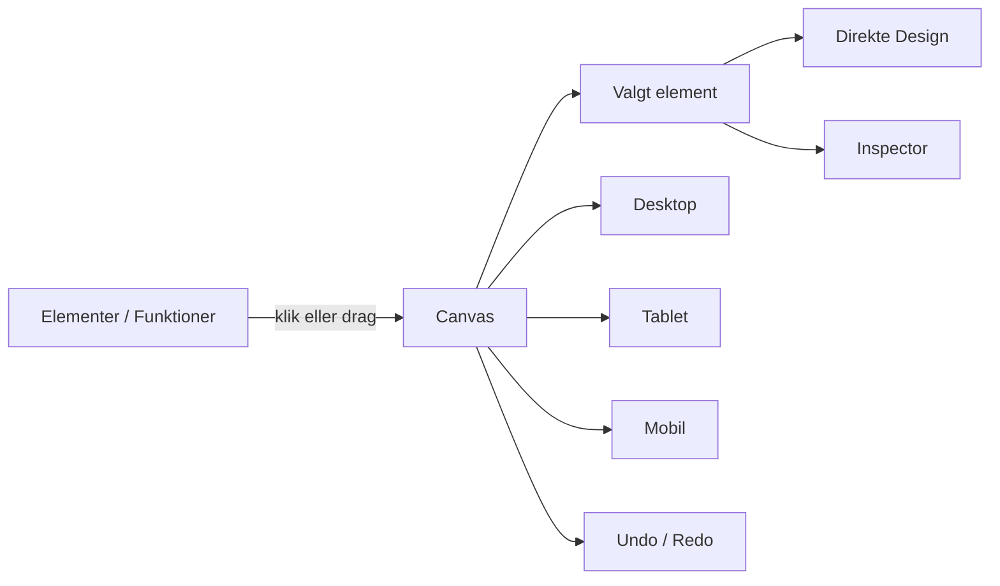
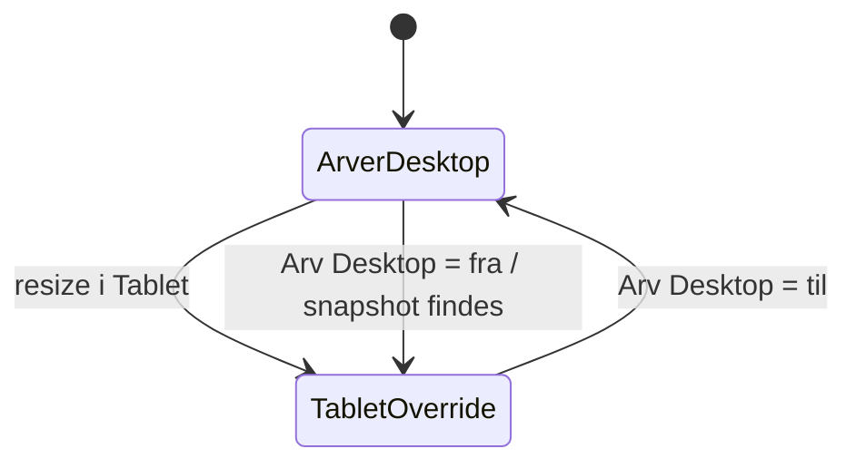
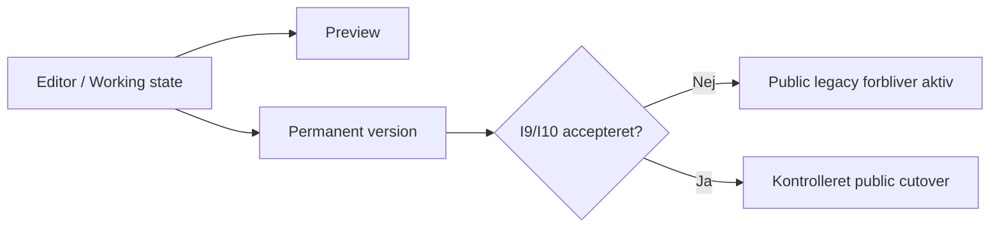

# Ultimate Designer — visuel brugermanual

**Dokumentstatus:** DOC-1  
**Gælder for editorarkitekturen gennem LEGO-033**  
**Pluginbaseline:** Hangar18 Manager v0.8.39  
**Senest opdateret:** 21. august 2026

Denne manual beskriver den praktiske arbejdsgang i Hangar18 Ultimate Designer. Den supplerer `DESIGN-MANUAL.md`, som fortsat er den visuelle designkontrakt, og `ultimate-designer-onboarding.md`, som beskriver den overordnede administrator-/designerproces.

> Vigtigt: Vehicle, Event og Gallery er fortsat beskyttede legacy-domæner. De må ikke public-konverteres gennem den nye renderer, før I9/I10-gates er accepteret.

---

## 1. Editorens grundidé

Ultimate Designer skal opleves som at bygge med LEGO-klodser:

- **Elementer/Funktioner** til venstre er de klodser, der kan indsættes.
- **Canvas** i midten viser sidens struktur og visuelle sammensætning.
- **Inspector / Direkte Design** styrer det valgte elements indhold, layout og design.
- **Desktop / Tablet / Mobil** skifter den responsive arbejdsvisning.
- **Undo / Redo** fortryder eller gendanner én logisk brugerhandling ad gangen.



### Autoritativ arkitektur

Editoren har ikke flere konkurrerende layoutmotorer:

- `LayoutParentKey` er den autoritative parent/child-relation.
- Auto-kasser er den eksisterende række-/side-by-side-motor.
- Visuelle drop-zoner er kun målvisning oven på samme placement-motor.
- 12-kolonne spans er bredde-state oven på samme Auto-kasser-række.
- Tablet/Mobil er responsive overrides oven på samme span-store.
- Undo/Redo har én history-owner.

---

## 2. Opret og indsæt elementer

1. Åbn **Hangar18 Manager → Sider**.
2. Åbn en redigerbar almindelig side.
3. Find elementet under **Elementer/Funktioner**.
4. Klik elementet ind eller træk det til canvas.
5. Vælg elementet på canvas for at redigere det.

Typiske elementer omfatter tekst, billede, knap, Kasse/container, Grid/Flex og dynamiske funktionsmoduler.

### Kasse som container

En Kasse bruges til at samle ét eller flere elementer. En Kasse kan have eget:

- baggrundsdesign;
- kant og hjørneafrunding;
- padding og intern X/Y-afstand;
- responsive designværdier;
- interaction states.

Brug Kasse, når elementer logisk hører sammen, ikke blot for at skabe tilfældig luft.

---

## 3. Flyt elementer med fire drop-zoner

Når et understøttet element trækkes, viser editoren fire visuelle placeringer omkring et kompatibelt mål:

```text
            ┌───────────────┐
            │     OVER      │
            └───────────────┘
    ┌──────────┐       ┌──────────┐
    │ VENSTRE  │  MÅL  │  HØJRE   │
    └──────────┘       └──────────┘
            ┌───────────────┐
            │     UNDER     │
            └───────────────┘
```

### Over / Under

**Over** og **Under** ændrer den lodrette rækkefølge. Den eksisterende sortable/placement-motor ejer fortsat rækkefølgen.

### Venstre / Højre

**Venstre** og **Højre** opretter eller genbruger en Auto-kasser-række, så elementerne står side om side.

For almindelige elementer kan editoren automatisk oprette de nødvendige wrapper-strukturer. Dette ændrer ikke den grundlæggende parent-model: `LayoutParentKey` forbliver autoritativ.

### History-regel

Ét gennemført side-drop tæller som **én** brugerhandling i Undo/Redo, selv om editoren internt kan oprette Auto-kasser/wrappers og ændre flere parent/order-værdier.

---

## 4. Side-by-side og 12-kolonne layout

Når elementer står side om side, bruger editoren en usynlig **12-kolonne grid**.

Eksempler:

| Struktur | Typisk startfordeling |
|---|---:|
| 2 elementer | 6 / 6 |
| 3 elementer | 4 / 4 / 4 |
| 4 elementer | 3 / 3 / 3 / 3 |

Visuelt:

```text
12 kolonner
┌────────────────────────────────────────────────────┐
│ 1 │ 2 │ 3 │ 4 │ 5 │ 6 │ 7 │ 8 │ 9 │10 │11 │12 │
└────────────────────────────────────────────────────┘

6 / 6
┌─────────────────────────┬──────────────────────────┐
│        ELEMENT A        │        ELEMENT B         │
└─────────────────────────┴──────────────────────────┘

8 / 4
┌─────────────────────────────────┬──────────────────┐
│            ELEMENT A            │    ELEMENT B     │
└─────────────────────────────────┴──────────────────┘
```

Regler:

- minimum span er 1 kolonne;
- summen af direkte børn i samme Auto-kasser-række må ikke overstige 12;
- ændring af grænsen mellem to naboer kompenserer naboens bredde;
- resize ændrer ikke `LayoutParentKey`.

---

## 5. Ændr bredde direkte med musen

Mellem side-by-side-elementer vises et resize-håndtag.

1. Hold musen over grænsen mellem to nabo-elementer.
2. Tryk og hold på resize-håndtaget.
3. Træk mod venstre eller højre.
4. Slip musen, når fordelingen er korrekt.

Eksempel:

```text
Før:        6 / 6
            ┌────────────┬────────────┐
            │     A      │     B      │
            └────────────┴────────────┘
                         ↕ håndtag

Træk →      8 / 4
            ┌────────────────┬────────┐
            │       A        │   B    │
            └────────────────┴────────┘
```

Et pointerforløb fra nedtryk til slip gemmes som **ét history-checkpoint**. Undo gendanner begge berørte spans i samme trin.

---

## 6. Desktop, Tablet og Mobil

Skift arbejdsvisning med enhedskontrollen.

```text
[ Desktop ]   [ Tablet ]   [ Mobil ]
     ↑             ↑            ↑
   base         override      override
```

### Desktop

Desktop er den kanoniske basis for span-layout.

### Tablet og Mobil

Tablet og Mobil **arver Desktop**, indtil der oprettes en eksplicit override.

Hvis Desktop er 6/6:

```text
Desktop: 6 / 6
Tablet:  arver 6 / 6
Mobil:   arver 6 / 6
```

Hvis du resizer i Tablet til 8/4:

```text
Desktop: 6 / 6     ← uændret
Tablet:  8 / 4     ← eksplicit override
Mobil:   6 / 6     ← arver fortsat Desktop
```

Tablet/Mobil-resize bruger samme 12-kolonne model og samme Undo/Redo-owner som Desktop.

---

## 7. `Arv Desktop`

Når en responsive span-override findes, kan den midlertidigt sættes tilbage til Desktop-arv med **Arv Desktop**.

Vigtig detalje: override-snapshot slettes ikke.

Eksempel:

1. Desktop = 6/6.
2. Tablet ændres til 8/4.
3. `Arv Desktop` aktiveres → Tablet viser 6/6.
4. `Arv Desktop` deaktiveres igen → den tidligere Tablet-override 8/4 gendannes.



Det gør responsive eksperimenter reversible uden at miste den tidligere tilpassede værdi.

---

## 8. Spacing: X og Y

Spacing skal styres bevidst i to retninger:

- **X** = vandret afstand.
- **Y** = lodret afstand.

Det gælder både gap mellem børn og margin/padding, afhængigt af elementtypen.

```text
             Y
             ↑
      ┌──────────────┐
 X ←  │   ELEMENT    │  → X
      └──────────────┘
             ↓
             Y
```

Brug den globale designmanual som standard, og lav kun lokale afvigelser, når layoutet kræver det.

---

## 9. Direkte Design og Inspector

**Direkte Design · LEGO** og **Inspector** er to visninger af den samme kanoniske design-/layout-state. De må ikke behandles som to separate designsystemer.

Typiske områder:

- typografi;
- tekst- og baggrundsfarver;
- kant;
- radius;
- opacity;
- shadow;
- padding/margin/gap;
- responsive overrides;
- Hover / Focus / Active / Disabled.

De foldbare værktøjspaneler starter minimeret og husker deres browser-lokale foldestatus. At folde et panel ind eller ud opretter ikke et history-checkpoint.

---

## 10. Interaction states

Elementer kan have designværdier for:

- Normal;
- Hover;
- Focus;
- Active;
- Disabled.

Focus må ikke designes væk. Keyboardbrugere skal fortsat kunne se, hvilket interaktivt element der har fokus.

Ved ændringer af interaction state gælder samme princip som andre redigeringer: én logisk brugerændring skal give ét history-trin.

---

## 11. Undo og Redo

Undo/Redo er en central sikkerhedsmekanisme og har én history-owner.

Forventet adfærd:

| Handling | Undo-resultat |
|---|---|
| flyt element | tidligere placering gendannes |
| Venstre/Højre side-drop | wrappers, parent/order og layout gendannes samlet |
| resize 6/6 → 8/4 | begge naboer går tilbage til 6/6 |
| Tablet resize | kun Tablet-layoutet gendannes |
| responsive designændring | tidligere responsive state gendannes |
| tekst-/billedændring | tidligere indhold gendannes |

Efter Undo kan Redo genanvende samme handling.

---

## 12. Gem, versioner og backup

Permanent save og Undo/Redo er forskellige sikkerhedslag.

1. Arbejd på canvas.
2. Brug Undo/Redo under redigeringen.
3. Kontrollér Desktop, Tablet og Mobil.
4. Tilføj en meningsfuld ændringsnote.
5. Brug **Gem** / **Gem som ny version**.

En rigtig gemning skal følge version-/backupflowet. Autosave er crash recovery og erstatter ikke en permanent version.

WhatIf/simulering må bruges, når en funktion eksplicit understøtter det; WhatIf er ikke en almindelig erstatning for preview.

---

## 13. Preview og public side

Working state og Public state er adskilt.



Den nuværende udvikling af Ultimate Designer betyder **ikke**, at eksisterende public-sider automatisk konverteres.

---

## 14. Vehicle, Event og Gallery

Disse domæner er beskyttede under migrationen:

- Køretøjer / Vehicle;
- Events;
- Billedgalleri / Gallery.

De eksisterende specialiserede editorer og public outputs skal fortsætte uændret, indtil der foreligger særskilt compatibility proof og I9/I10 acceptance.

Brug derfor ikke en generel sidekonvertering som genvej til at flytte disse domæner over på Ultimate Designer.

---

## 15. Praktisk byggeeksempel

Mål: tekst til venstre og billede til højre på Desktop, bredere tekst på Tablet og samme Desktop-layout på Mobil.

### Trin 1 — indsæt

- indsæt Tekst;
- indsæt Billede.

### Trin 2 — side-by-side

Træk Billede til **Højre** for Tekst.

Resultat:

```text
Desktop 6 / 6
┌─────────────────────────┬──────────────────────────┐
│          Tekst          │          Billede         │
└─────────────────────────┴──────────────────────────┘
```

### Trin 3 — resize Desktop

Træk grænsen til 7/5.

```text
Desktop 7 / 5
┌─────────────────────────────┬──────────────────────┐
│            Tekst            │       Billede        │
└─────────────────────────────┴──────────────────────┘
```

### Trin 4 — Tablet override

Skift til Tablet og resize til 8/4.

```text
Desktop: 7 / 5
Tablet:  8 / 4
Mobil:   arver 7 / 5
```

### Trin 5 — test Arv Desktop

Aktivér `Arv Desktop` på Tablet. Tablet viser 7/5. Deaktivér igen; 8/4 vender tilbage.

### Trin 6 — Undo-test

Brug Undo én gang og verificér, at seneste logiske handling fortrydes samlet.

---

## 16. Før du gemmer — hurtig kontrol

- [ ] Elementernes hierarki ser korrekt ud.
- [ ] Venstre/Højre-layout har de ønskede proportioner.
- [ ] Desktop er kontrolleret.
- [ ] Tablet er kontrolleret.
- [ ] Mobil er kontrolleret.
- [ ] Responsive overrides findes kun, hvor de er nødvendige.
- [ ] `Arv Desktop` opfører sig som forventet.
- [ ] Ingen vandret overflow er opstået.
- [ ] Tekst/knapper har tilstrækkelig kontrast.
- [ ] Keyboard focus er synligt.
- [ ] Undo/Redo kan gendanne seneste væsentlige handling.
- [ ] Vehicle/Event/Gallery er ikke utilsigtet påvirket.
- [ ] Ændringsnote er skrevet før permanent save.

---

## 17. Fejlfinding

### Elementet vil ikke stå ved siden af et andet

Kontrollér at målet er kompatibelt, og at du slipper i **Venstre** eller **Højre**-zonen. Editorens depth/cycle-regler må ikke omgås.

### Resize-håndtaget vises ikke

Resize kræver side-by-side børn i samme Auto-kasser-række. En almindelig lodret liste har ingen fælles span-grænse.

### Tablet/Mobil ændrer også Desktop

Det er ikke forventet for en responsive override. Kontrollér at den rigtige enhedsvisning er valgt, og at du ikke redigerer en fælles designværdi uden responsive override.

### `Arv Desktop` mister min tidligere override

Det er ikke forventet. Override-snapshot skal bevares og kunne gendannes, når arv slås fra igen.

### Undo giver flere trin for ét side-drop eller resize

Det er en regression. Ét side-drop og ét resize pointerforløb skal hver være ét logisk checkpoint.

---

## 18. Kvalitetsniveau før public cutover

Automatiseret QA er nødvendig, men ikke tilstrækkelig til public cutover. I9 kræver fortsat manuelle/live beviser for:

1. Chrome;
2. Edge;
3. Firefox;
4. Safari;
5. screen reader core flow;
6. `test2` live-site E2E;
7. Vehicle/Event/Gallery visual/function regression;
8. migration/rollback på en live kopi.

Først efter I9 PASS kan I10's kontrollerede conversion-rækkefølge begynde.
